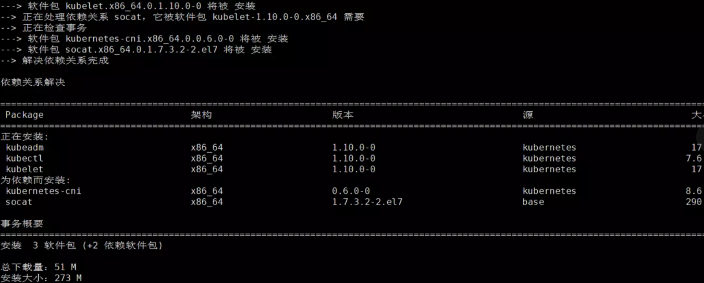
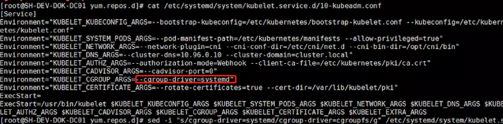
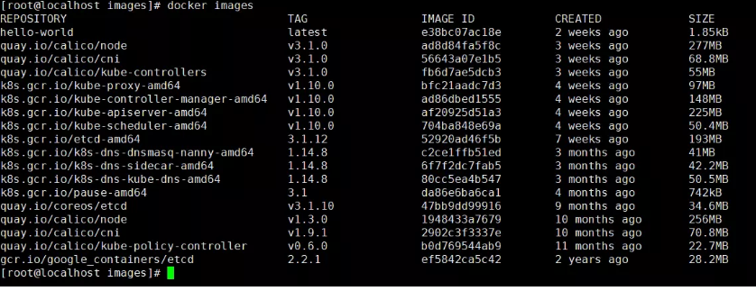
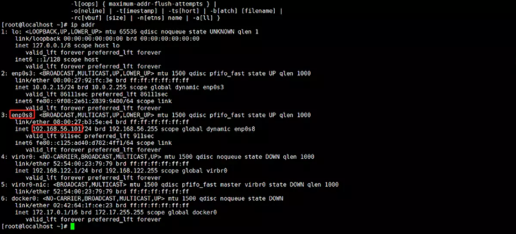
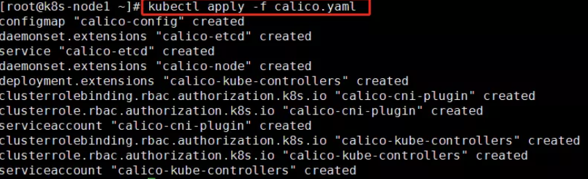
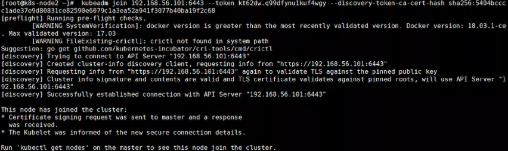
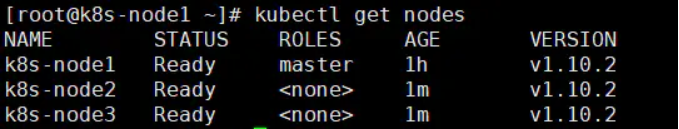
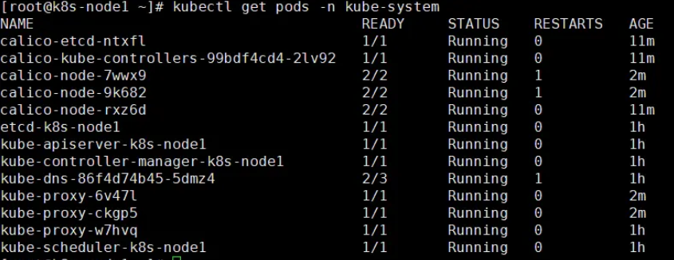

一、准备
--------

利用VirtualBox的虚拟机复制功能，复制出两个完全一样的虚拟机作为工作节点。三者角色为：

-   Node1：Master

-   Node2：Woker

-   Node3：Woker

二、安装Kubernetes
------------------

### 配置K8S的yum源

官方仓库无法使用，使用阿里源的仓库，执行以下命令添加kubernetes.repo仓库：

> cat \<\<EOF \> /etc/yum.repos.d/kubernetes.repo

> [kubernetes]

> name=Kubernetes

> baseurl=http://mirrors.aliyun.com/kubernetes/yum/repos/kubernetes-el7-x86_64

> enabled=1

> gpgcheck=0

> repo_gpgcheck=0

> gpgkey=http://mirrors.aliyun.com/kubernetes/yum/doc/yum-key.gpg

> http://mirrors.aliyun.com/kubernetes/yum/doc/rpm-package-key.gpg

> EOF

### 关闭swap、防火墙

### 关闭SeLinux

执行：setenforce 0

### 安装K8S组件

执行以下命令安装kubelet、kubeadm、kubectl：

yum install -y kubelet kubeadm kubectl

如下图所示：



### 配置kubelet的cgroup drive

docker info \| grep -i cgroup

cat /etc/systemd/system/kubelet.service.d/10-kubeadm.conf

如图：



### 启动kubelet

注意，根据官方文档描述，安装kubelet、kubeadm、kubectl三者后，要求启动kubelet：  
systemctl enable kubelet && systemctl start kubelet

### 下载K8S的Docker镜像

脚本docker_images_load.sh用于导入镜像：

> docker load \< quay.io\#calico\#node.tar

> docker load \< quay.io\#calico\#cni.tar

> docker load \<quay.io\#calico\#kube-controllers.tar

> docker load \< k8s.gcr.io\#kube-proxy-amd64.tar

> docker load \< k8s.gcr.io\#kube-scheduler-amd64.tar

> docker load \< k8s.gcr.io\#kube-controller-manager-amd64.tar

> docker load \< k8s.gcr.io\#kube-apiserver-amd64.tar

> docker load \< k8s.gcr.io\#etcd-amd64.tar

> docker load \< k8s.gcr.io\#k8s-dns-dnsmasq-nanny-amd64.tar

> docker load \< k8s.gcr.io\#k8s-dns-sidecar-amd64.tar

> docker load \< k8s.gcr.io\#k8s-dns-kube-dns-amd64.tar

> docker load \< k8s.gcr.io\#pause-amd64.tar

> docker load \< quay.io\#coreos\#etcd.tar

> docker load \< quay.io\#calico\#node.tar

> docker load \< quay.io\#calico\#cni.tar

> docker load \< quay.io\#calico\#kube-policy-controller.tar

> docker load \< gcr.io\#google_containers\#etcd.tar

运行docker images，如下图所示，即表示镜像导入成功：



三、复制虚拟机
--------------

### 复制

新的节点命名为CentOS-Node2，再复制一个节点命名为CentOS-Node3。

### 添加网卡



网卡enp0s8为新添加的网卡2，IP地址为192.168.56.101。三个节点IP分别为：

-   Node1：192.168.56.101

-   Node2：192.168.56.102

-   Node3：192.168.56.103

在这三个节点中，可以使用这些IP互相ping一下，确保网络连通正常。

另外，同上一节所述，建议启用端口转发功能，使用Xshell连接到Node1和Node2的终端。

### 设置虚拟机

以主节点Node1为例：

-   编辑/etc/hostname，将hostname修改为k8s-node1

-   编辑/etc/hosts，追加内容 IP k8s-node1

以上IP为网卡2的IP地址，修改后重启生效。另外两个节点主机名分别为k8s-node2、k8s-node3。

四、创建集群
------------

### 创建集群

在Master主节点（k8s-node1）上执行:  
> kubeadm init --pod-network-cidr=192.168.0.0/16 --kubernetes-version=v1.10.0
--apiserver-advertise-address=192.168.56.101

执行结果：
```

[root\@k8s-node1 \~]\# kubeadm init --pod-network-cidr=192.168.0.0/16
--kubernetes-version=v1.10.0 --apiserver-advertise-address=192.168.56.101

[init] Using Kubernetes version: v1.10.0

[init] Using Authorization modes: [Node RBAC]

[preflight] Running pre-flight checks.

[WARNING SystemVerification]: docker version is greater than the most recently
validated version. Docker version: 18.03.1-ce. Max validated version: 17.03

[WARNING FileExisting-crictl]: crictl not found in system path

Suggestion: go get github.com/kubernetes-incubator/cri-tools/cmd/crictl

[certificates] Generated ca certificate and key.

[certificates] Generated apiserver certificate and key.

[certificates] apiserver serving cert is signed for DNS names [k8s-node1
kubernetes kubernetes.default kubernetes.default.svc
kubernetes.default.svc.cluster.local] and IPs [10.96.0.1 192.168.56.101]

[certificates] Generated apiserver-kubelet-client certificate and key.

[certificates] Generated etcd/ca certificate and key.

[certificates] Generated etcd/server certificate and key.

[certificates] etcd/server serving cert is signed for DNS names [localhost] and
IPs [127.0.0.1]

[certificates] Generated etcd/peer certificate and key.

[certificates] etcd/peer serving cert is signed for DNS names [k8s-node1] and
IPs [192.168.56.101]

[certificates] Generated etcd/healthcheck-client certificate and key.

[certificates] Generated apiserver-etcd-client certificate and key.

[certificates] Generated sa key and public key.

[certificates] Generated front-proxy-ca certificate and key.

[certificates] Generated front-proxy-client certificate and key.

[certificates] Valid certificates and keys now exist in "/etc/kubernetes/pki"

[kubeconfig] Wrote KubeConfig file to disk: "/etc/kubernetes/admin.conf"

[kubeconfig] Wrote KubeConfig file to disk: "/etc/kubernetes/kubelet.conf"

[kubeconfig] Wrote KubeConfig file to disk:
"/etc/kubernetes/controller-manager.conf"

[kubeconfig] Wrote KubeConfig file to disk: "/etc/kubernetes/scheduler.conf"

[controlplane] Wrote Static Pod manifest for component kube-apiserver to
"/etc/kubernetes/manifests/kube-apiserver.yaml"

[controlplane] Wrote Static Pod manifest for component kube-controller-manager
to "/etc/kubernetes/manifests/kube-controller-manager.yaml"

[controlplane] Wrote Static Pod manifest for component kube-scheduler to
"/etc/kubernetes/manifests/kube-scheduler.yaml"

[etcd] Wrote Static Pod manifest for a local etcd instance to
"/etc/kubernetes/manifests/etcd.yaml"

[init] Waiting for the kubelet to boot up the control plane as Static Pods from
directory "/etc/kubernetes/manifests".

[init] This might take a minute or longer if the control plane images have to be
pulled.

[apiclient] All control plane components are healthy after 24.006116 seconds

[uploadconfig] Storing the configuration used in ConfigMap "kubeadm-config" in
the "kube-system" Namespace

[markmaster] Will mark node k8s-node1 as master by adding a label and a taint

[markmaster] Master k8s-node1 tainted and labelled with key/value:
node-role.kubernetes.io/master=""

[bootstraptoken] Using token: kt62dw.q99dfynu1kuf4wgy

[bootstraptoken] Configured RBAC rules to allow Node Bootstrap tokens to post
CSRs in order for nodes to get long term certificate credentials

[bootstraptoken] Configured RBAC rules to allow the csrapprover controller
automatically approve CSRs from a Node Bootstrap Token

[bootstraptoken] Configured RBAC rules to allow certificate rotation for all
node client certificates in the cluster

[bootstraptoken] Creating the "cluster-info" ConfigMap in the "kube-public"
namespace

[addons] Applied essential addon: kube-dns

[addons] Applied essential addon: kube-proxy

Your Kubernetes master has initialized successfully!

To start using your cluster, you need to run the following as a regular user:

mkdir -p \$HOME/.kube

sudo cp -i /etc/kubernetes/admin.conf \$HOME/.kube/config

sudo chown \$(id -u):\$(id -g) \$HOME/.kube/config

You should now deploy a pod network to the cluster.

Run "kubectl apply -f [podnetwork].yaml" with one of the options listed at:

https://kubernetes.io/docs/concepts/cluster-administration/addons/

You can now join any number of machines by running the following on each node

as root:

kubeadm join 192.168.56.101:6443 --token kt62dw.q99dfynu1kuf4wgy
--discovery-token-ca-cert-hash
sha256:5404bcccc1ade37e9d80831ce82590e6079c1a3ea52a941f3077b40ba19f2c68
```

可以看到，提示集群成功初始化，执行以下命令：

> mkdir -p \$HOME/.kube

> sudo cp -i /etc/kubernetes/admin.conf \$HOME/.kube/config

> sudo chown \$(id -u):\$(id -g) \$HOME/.kube/config

另外，还需要创建网络，并且让其他节点执行kubeadm join...加入集群。

### 创建网络

根据官方文档，在主节点上，需要执行如下命令：  
> kubectl apply -f
<https://docs.projectcalico.org/v3.1/getting-started/kubernetes/installation/hosted/kubeadm/1.7/calico.yaml>



五、集群设置
------------

### 将其他节点加入集群

在其他两个节点k8s-node2和k8s-node3上，执行主节点生成的kubeadm join命令加入集群：  
> kubeadm join 192.168.56.101:6443 --token kt62dw.q99dfynu1kuf4wgy
--discovery-token-ca-cert-hash
sha256:5404bcccc1ade37e9d80831ce82590e6079c1a3ea52a941f3077b40ba19f2c68

加入成功后，提示：



### 验证集群是否正常

当所有节点加入集群后，稍等片刻，在主节点上运行kubectl get nodes可以看到：



查看所有pod状态，运行kubectl get pods -n kube-system：



六、配置scheduler
-----------------

有三种方法可以向Kubernetes添加新的调度规则（谓词和优先级函数）：

（1）通过将这些规则添加到调度程序并重新编译

（2）实现自己的调度程序进程，以代替或与之并行运行，标准Kubernetes调度程序

（3）实现一个“调度程序扩展程序”过程，标准Kubernetes调度程序在制定调度决策时将其作为最终过程。

修改k8s-scheduler/main.go文件里的调度函数
```
TruePredicate = Predicate{

Name: "always_true",

Func: func(pod v1.Pod, node v1.Node) (bool, error) {

const max int = 3

var condition bool = max \> len(pod.Name)

if condition{

return true, nil

}

return false, fmt.Errorf("pod length exceed ")

},

}
```